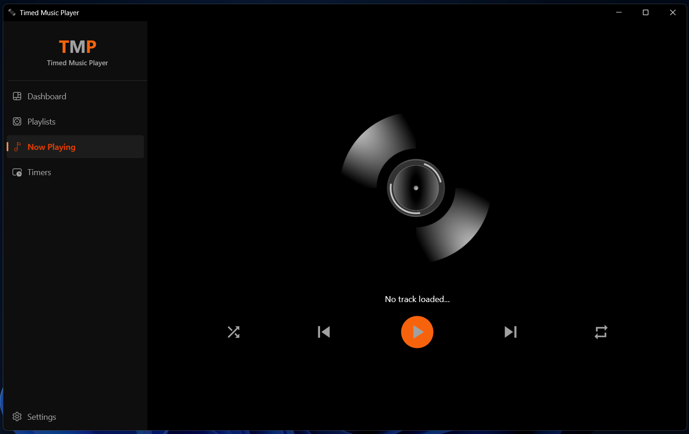

# Timed Player

A music player application with advanced timer functionality. Timed Player allows you to schedule music playback with precise timing control.

**Note** This code was tested on Windows 11, but it should work on other desktop platforms with little or no modification.



## Features

- **Music Playback**: Play audio files.
- **Timer Management**: Create and manage player and track timers
- **Playlist Support**: Organize your music into playlists.
- **Scheduled Playback**: Set timers to automatically start/stop music at specific times.
- **Modern UI**: Dark-Themed and user friendly interface.
- **Data Persistence**: All settings, playlists, and timers are saved locally.

**Note:** The database does not store any music files; it only contains references to their local file paths.

## Project Structure

```
lib/
├── commons/               # Shared utilities and widgets
│   ├── extensions/        # App-wide extensions
│   ├── logic/             # Shared business logic
│   ├── providers/         # Global providers
│   └── widgets/           # Reusable UI components
├── core/                  # Core application components
│   ├── config/            # Theme configurations
│   ├── constants/         # App constants
│   ├── services/          # Core services (audio, timer, persistence)
│   └── utils/             # Utility functions
├── data/                  # Data models and adapters
│   └── models/            # Hive data models
└── features/              # Feature-based modules
    ├── base/              # Base views and widgets
    ├── player/            # Music player functionality
    ├── playlist/          # Playlist management
    ├── settings/          # Application settings
    └── timers/            # Timer management
```

## Prerequisites

- Flutter SDK (3.8.1 or higher)
- Dart SDK
- Windows 10/11
- Visual Studio with C++ development tools
- OpenSSL toolkit (for code signing)

## Installation

### 1. Clone the Repository

```bash
git clone <repository-url>
cd timed_app
```

### 2. Install Dependencies

```bash
flutter pub get
```

### 3. Generate Code

```bash
flutter packages pub run build_runner build
```

## Building the Application

### Development Build

```bash
flutter run -d windows
```

### Release Build

```bash
flutter build windows --release
```

The built application will be located at:

```
build/windows/x64/runner/Release/TimedPlayer.exe
```

## Code Signing and Distribution

### Certificate Generation

The project includes a self-signed certificate for code signing. Follow these steps to set up code signing:

#### 1. Generate Private Key

```bash
openssl genrsa -out timedplayerkey.key 2048
```

#### 2. Generate Certificate Signing Request (CSR)

```bash
openssl req -new -key timedplayerkey.key -out timedplayercsr.csr -config "C:\Program Files\OpenSSL-Win64\bin\openssl.cfg"
```

**Certificate Details:**

- Country Name: `QA`
- State or Province Name: `Doha`
- Locality Name: `Doha`
- Organization Name: `<Organization>`
- Organizational Unit Name: `Timed Player`
- Common Name: `<YOYR SUBJECT>`
- Challenge Password: `TimedPlayer` <!-- Your password -->
- Optional Company Name: `<Company>`

#### 3. Generate Signed Certificate

```bash
openssl x509 -in timedplayercsr.csr -out timedplayercert.crt -req -signkey timedplayerkey.key -days 10000
```

#### 4. Generate PFX Certificate

```bash
openssl pkcs12 -export -out TIMEDPLAYERCERTPFX.pfx -inkey timedplayerkey.key -in timedplayercert.crt
```

Password: `TimedPlayer`

#### 5. Install Certificate

```powershell
$pwd = ConvertTo-SecureString -String "TimedPlayer" -Force -AsPlainText
Import-PfxCertificate -FilePath "<YOUR PATH>\TIMEDPLAYERCERTPFX.pfx" -CertStoreLocation "Cert:\LocalMachine\Root" -Password $pwd
```

#### 6. Sign the Application

```bash
signtool sign /f "<YOUR PATH>\TIMEDPLAYERCERTPFX.pfx" /p "TimedPlayer" /fd SHA256 /tr http://timestamp.digicert.com /td SHA256 "<YOUR PATH>\build\windows\x64\runner\Release\TimedPlayer.exe"
```

## Installer Creation

The project includes an Inno Setup script (`build_script.iss`) for creating a Windows installer.

### Installer Features

- **Application Info**: Timed Player v1.0.0
- **Installation Directory**: `Program Files\TimedPlayer`
- **Desktop Shortcut**: Creates desktop shortcut for easy access
- **Start Menu Entry**: Adds application to Start Menu
- **Auto-launch**: Option to launch application after installation
- **Uninstaller**: Complete uninstallation support

### Building the Installer

1. Install [Inno Setup](https://jrsoftware.org/isinfo.php)
2. Open `build_script.iss` in Inno Setup Compiler
3. Build the installer
4. The installer will be created in the `Installer/` directory as `TimedPlayerInstaller.exe`

### Pre-built Installer

A pre-built installer is available in the `Installer/` directory:

- **File**: `TimedPlayerInstaller.exe`
- **Size**: ~10MB
- **Features**: Complete installation package with all dependencies

## Usage

1. **Launch the Application**: Run `TimedPlayer.exe` or use the desktop shortcut
2. **Load Music**: Use the playlist feature to load your music files
3. **Create Timers**: Set up player timers or track timers for scheduled playback
4. **Play Music**: Use the main interface to control playback
5. **Manage Settings**: Configure application preferences in the settings screen

## Dependencies

### Core Dependencies

- `flutter_riverpod`: State management
- `audioplayers`: Audio playback functionality
- `hive`: Local data storage
- `window_manager`: Windows-specific window management
- `file_picker`: File selection for playlists
- `path_provider`: Provides database files location

### Development Dependencies

- `build_runner`: Code generation
- `hive_generator`: Hive model generation
- `msix`: Windows packaging (optional)

## Development

### Running Tests [Todo]

```bash
flutter test
```

### Local database models generation

```bash
dart run build_runner build --delete-conflicting-outputs
```

### Linting

```bash
flutter analyze
```

## Contributing

1. Fork the repository
2. Create a feature branch
3. Make your changes
4. Run tests and ensure code quality
5. Submit a pull request

## License

This project is licensed under the MIT License - see the [LICENSE](LICENSE) file for details.

Copyright (c) 2025 Lazarus Muya

## Support

For issues, questions, or contributions, please refer to the project repository or contact developer.

---

**Note**: This application requires Windows 10/11 and proper audio drivers for optimal functionality. The self-signed certificate should only be used for development and testing purposes.
